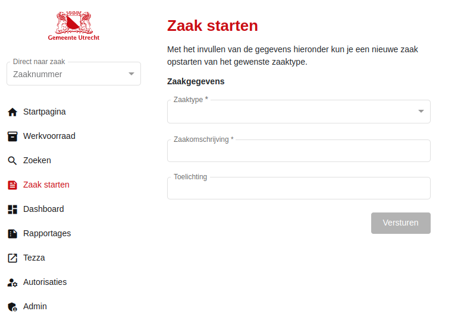

.. _zaak-starten-actions:

Zaak starten
============

An end-user can start a ``ZAAK`` through `zaak starten <https://zac.cg-intern.utrecht.nl/ui/zaak-starten>`_.
They will end up on the screen as shown below:

    Zaak starten screen

Here they have to:

  1. Select a ``ZAAKTYPE`` (limited by the user's permissions).
  2. Give a description (`omschrijving`).
  3. Optionally add comments (`toelichting`).

The list of ``ZAAKTYPEs`` are cached for performance. Cache automatically invalidates within 1 day.
Generally if a ``ZAAKTYPE`` is created or (partially) updated, a notification will be sent out and 
will also invalidate the cache. This forces the ZAC to refetch and recache the list of ``ZAAKTYPEs``.

Whenever a ``ZAAK`` is created through this method in the background the following happens:

  1. The ``ZAAKTYPE`` gets validated and the requesting user's permissions are consulted. The ``ZAAKTYPE`` needs to exist and be valid on the current date.
  2. The requesting user will be set to the `initiator` ``ROL`` if its ``ROLTYPE`` exists (it generally should).
  3. A `start-process` request is sent to Camunda, starting the :ref:`zaak aanmaken bpmn <zaak-aanmaken-bpmn>`.
  4. A process instance ID is returned to the ZAC. The frontend will start polling the ZAC until a ``ZAAK`` URL is made available (available from step 7 onwards).
  5. The camunda process will then set the service task to be picked up by the BPTL workers.
  6. The BPTL workers poll every x-seconds to see if a service task is available and pick it up.
  7. The BPTL worker will perform the task, creating the ``ZAAK`` in Open Zaak.
  8. The creation of the ``ZAAK`` in Open Zaak sends out a notification. This gets picked up by whoever is subscribed.
  9. In the ZAC the notification is received and elastic search is forced to reindex, picking up the ``ZAAK``.
  10. Camunda will then proceed to start the relevant BPMN specific to the ``ZAAK``'s ``ZAAKTYPE``.
  11. On the ``ZAAK`` detail page the user is now able to work in the ``ZAAK`` and fill out the form required to continue its business process.

Troubleshooting
---------------

Please refer to :ref:`zaak aanmaken troubleshooting <zaak-aanmaken-troubleshooting>`.

