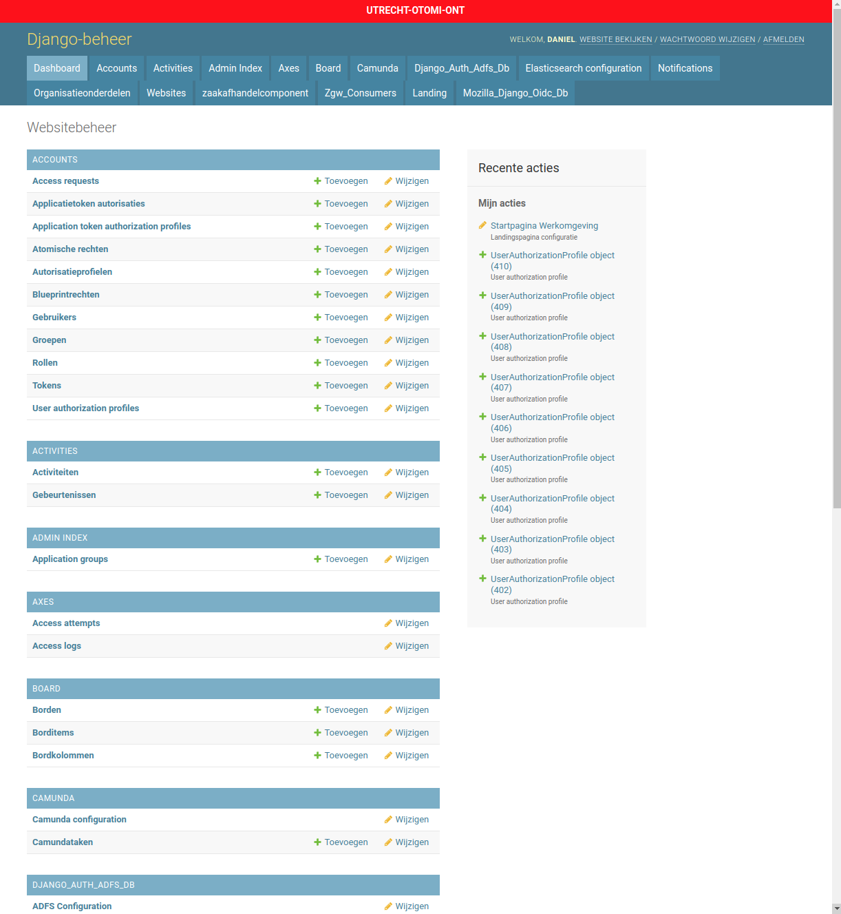

.. _admin-panel-appearance:

Admin panel appearance
======================

The admin panel looks like:

    Admin interface

In our implementation you can change the appearance of the admin panel by configuring the :class:`.ApplicationGroup` in the `admin index` group (relative URL: `/admin/admin_index/appgroup/`).

For example, our `Accounts` application group has the configuration seen in the figure `Accounts application group configuration`.

    
    Accounts application group configuration

It is recommended but not necessary to keep the configuration per environment consistent for easier navigation.
