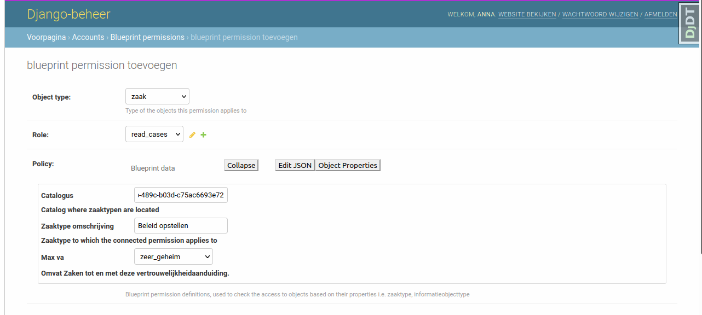
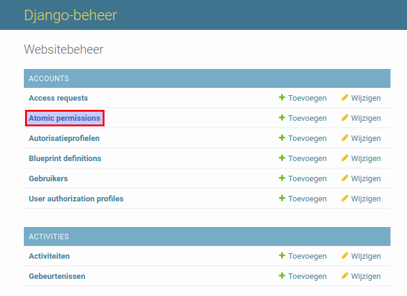
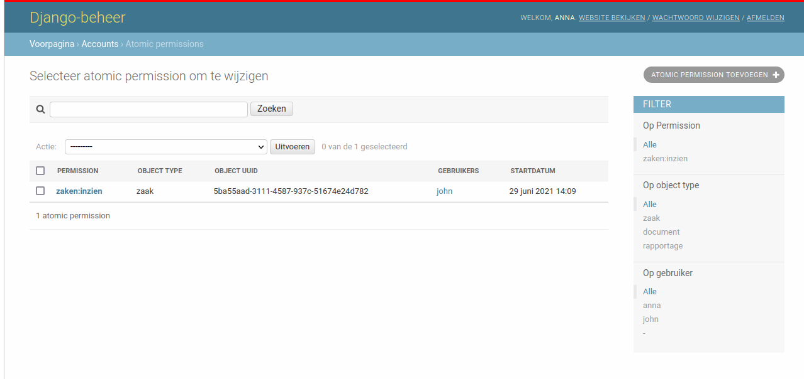

.. _authorization:

=============
Authorization
=============

The ZAC represents the application of the 5th layer of the Common Ground architecture. It
requests and modifies information from different APIs including Zaken API, Documenten API,
Kownsl API, etc. Therefore the ZAC has implemented the authorization model which ensures that
all the ZAC users have permission to perform necessary operations via these APIs.

Permission types
----------------
Each permission has the object type the permission relates to. For now three object types are supported:

* zaak (case)
* document
* report

Each permission provides the right to perform one of the following types of operations:

* zaak permissions:
    * ``zaken:inzien`` - to see the case details. It's the most used permission in the ZAC
    * ``zaken:wijzigen`` - to modify the case, for example, to change the confidentiality level
    * ``zaakproces:usertasks-uitvoeren`` - to perform Camunda tasks
    * ``zaakproces:send-bpmn-message`` - to send messages in the Camunda process
    * ``zaken:add-documents`` - to add documents to the case
    * ``zaken:nieuwe-relaties-toevoegen`` - to add new relations to the case
    * ``zaken:toegang-aanvragen`` - to request access to the case
    * ``zaken:toegang-verlenen`` - to manage access to the case
    * ``activities:read`` - to read activities of the case
    * ``activiteiten:schrijven`` - to add activities to the case

* document permissions:
    * ``zaken:download-documents`` - to see the metadata and content of the document
    * ``zaken:update-documents`` - to update the content of the document

* report permissions:
    * ``rapport:inzien`` - to see the report

The permissions used only in the old version of the ZAC:

* zaak permissions:
    * ``zaken:afsluiten`` - to close the case.
    * ``zaken:set-result`` - to set result to the case
    * ``zaken:create-status`` - to add status to the case

Each operation type has its required shape for a blueprint permission.
It is explained in the details in the "Blueprint permission" subsection.

Blueprint permissions
---------------------

The permissions in the ZAC can be divided into two groups:

* blueprint permissions
* atomic permissions.

The blueprint permission allows a user to perform a particular operation on the defined subset of the objects.
This is the main type of the permissions. Blueprint permissions are defined by functional managers
in the admin interface of the ZAC.

The user interface to manage them in the app is **WIP**.

The subset of the objects (or "blueprint") is defined based on object properties and unique for every permission type.
For now, two blueprints are supported:

* for zaak permissions:
    * zaaktype (``catalogus`` and ``omschrijving``)
    * maximum confidential level (``vertrouwelijkheidaanduiding``)

* for document permissions:
    * informatieobjecttype (``catalogus`` and ``omschrijving``)
    * maximum confidential level (``vertrouwelijkheidaanduiding``)

* for report permissions:
   * list of zaaktype identifications (``identificatie``)

The new blueprints can be easily defined for all kinds of objects and their properties.

.. note::

   If you want to quickly create permissions for all case types you can run the following command:

   .. code:: shell

      python src/manage.py add_blueprint_permissions_for_zaaktypen

Example
^^^^^^^

For example, we want to create a permission to read all cases with the case type "Beleid opstellen".

In the admin page click on the "Toevoegen" button for "Blueprint definitions":

.. image:: _assets/authorization_blueprint_add.png
    :alt: Click on the "Toevoegen" button for "Blueprint definitions"

After selecting ``permission`` field a ``policy`` fieldset appears. It represents the blueprint and
shows which objects properties this permission applies to. Fill in all the fields and click on
"opslaan" button.

The blueprint permission is created.

Authorization profiles
----------------------

Blueprint permissions can be grouped into authorization profiles that represent "roles" in the ZAC
authorization model. Each user can relate to one of many authorization profiles. Therefore it is
possible to create several profiles with typical permission groups (read-only, admin, etc.) and then
to relate users to them.

Like blueprint permissions authorization profiles are also managed by functional managers in the ZAC admin.

Example
^^^^^^^

In the previous subsection, we've created a blueprint permission to read cases with the case type
"Beleid opstellen". Now we want to grant this permission to the user called John.

In the admin interface click on the "Toevoegen" button for "Autorisatieprofielen":

.. image:: _assets/authorization_authprofile_add.png
    :alt: Click on the "Toevoegen" button for "Autorisatieprofielen"

Fill in the name and select all the blueprint permissions for the authorization profile.
It's possible to search on permission type and blueprint data in the select widget.
In the "User authorization profiles" section select all the users who will have this authorization
profile and click on "opslaan" button.

.. image:: _assets/authorization_authprofile_form.png
    :alt: Fill in authorization profile data

The authorization profile page displays how many blueprint permissions this profile has. You can click
on the number to see all the permissions.
You can also see which users have this profile.

.. image:: _assets/authorization_authprofile_list.png
    :alt: Auth profile page

Atomic permissions
------------------

Sometimes users should have extra rights for particular objects. For example, if the user should have rights
to read only particular cases of a certain case type then atomic permissions can be used.

Unlike blueprint permissions there are several sources of the atomic permissions for the users:

* the user is a **behandelaar** of the case. When this role is created (and the notification is received
  by the ZAC) the user receives a permission to read the case automatically.
* the user is required to be an **adviser** or **approver** of the case. When the review request is created
  the users mentioned there receive a permission to read the case and to perform Camunda tasks automatically.
* the user is assigned to a case **activity**. When the user is assigned to the activity they
  receive permissions to read the case and to read and update activities automatically.
* the user **requests access** to the particular case and this request was approved.
* the functional manager grants permission to the user.

The display of all the users and their atomic permissions for the case in the ZAC is **WIP** now.

.. note::

   If there are behandelaars, advisers and approvers who were created in the past and you want to create
   related atomic permissions for them you can run the following command:

   .. code:: shell

      python src/manage.py add_atomic_permissions

Example
^^^^^^^
For example, a user John has a blueprint permission to read all the cases of the "Beleid opstellen" case
type. But one of these cases has a related case with another case type ("Bestuurlijke besluitvorming").
John should not see all "Bestuurlijke besluitvorming" cases, but he can be granted an
atomic permission for the particular case.

To grant a permission an admin page can be used, but it's easier to do it in the app itself.

If you have a permission to manage access to cases, go to the page of the case with the
"Bestuurlijke besluitvorming" case type. In the top right corner of the page click on "Toegang verlenen"
button and select John as the user to who you grant access. After clicking on "Versturen" button the
atomic permission is created.

.. image:: _assets/authorization_atomic_grant.png
    :alt: Grant permission to the user

You can see the created permission on the admin page. Go to the "Atomic permissions" page in the ZAC
admin.

Here you can see the created permission. You can also filter on permission types and users here.

Relations between authorization objects
---------------------------------------

For development and administration purposes here is the ER diagram for the authorization models.
It shows how users, permissions and authorization profiles related to each other.

.. image:: _assets/authorization_er.png
    :alt: ER diagram

As you can see there are many-to-many relations between models:

* ``User`` and ``AuthorizationProfile``
* ``User`` and ``AtomicPermission``
* ``AuthorizationProfile`` and ``BlueprintPermission``

This structure helps to create unique blueprint and atomic permissions and relate users to these
objects.
