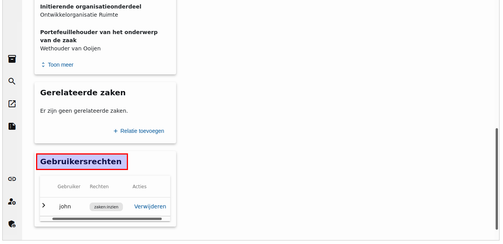
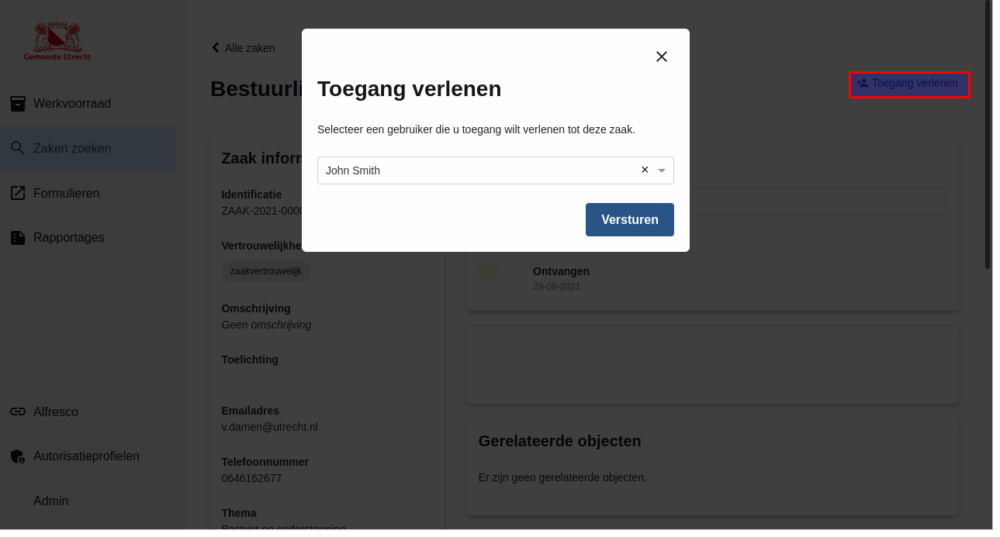
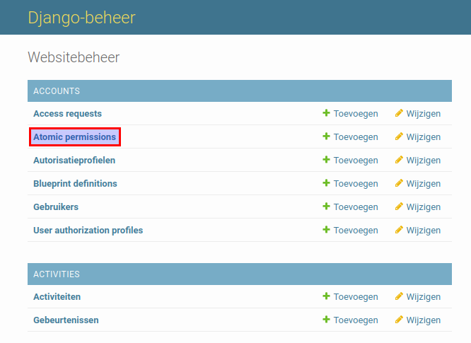
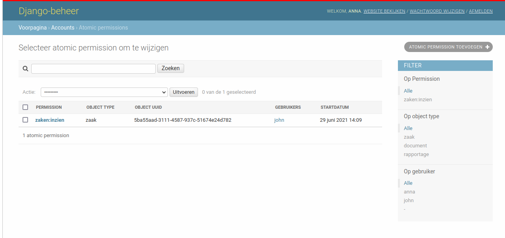

.. _atomic-permissions:

Atomic permissions
==================

Sometimes users should have extra rights for particular objects. For example, if the user should have rights
to read only particular ``ZAAKs`` of a certain ``ZAAKTYPE`` then atomic permissions can be used.

Unlike blueprint permissions there are several sources of the atomic permissions for the users.

* The user is a **behandelaar** of the ``ZAAK``. When this role is created (and the notification is received
  by the ZAC) the user receives a permission to read the ``ZAAK`` automatically.
* The user is required to be an **adviser** or **approver** of the ``ZAAK``. When the review request is created
  the users mentioned there receive a permission to read the ``ZAAK`` and to perform Camunda tasks automatically.
* The user is assigned to a ``ZAAK`` **activity**. When the user is assigned to the activity they
  receive permissions to read the ``ZAAK`` and to read and update activities automatically.
* The user **requests access** to the particular ``ZAAK`` and this request was approved.
* The functional manager grants permission to the user.

Unlike blueprint permissions atomic permissions don't use roles, since a part of them is created automatically
and can't rely on user-defined roles.

The display of all the users and their atomic permissions for the ``ZAAK`` is available in the ZAC user interface.

.. note::

   If there are behandelaars, advisers and approvers who were created in the past and you want to create
   related atomic permissions for them you can run the following command:

   .. code:: shell

      python src/manage.py add_atomic_permissions

Example
^^^^^^^

For example, a user John has a blueprint permission to read all the ``ZAAK``en of the "Beleid opstellen" ``ZAAKTYPE``. But one of these ``ZAAK``en has a related ``ZAAK`` with another ``ZAAKTYPE`` ("Bestuurlijke besluitvorming").
John should not see all "Bestuurlijke besluitvorming" ``ZAAK``en, but he can be granted an
atomic permission for the particular ``ZAAK``.

To grant a permission an admin page can be used, but it's easier to do it in the app itself.

If you have a permission to manage access to ``ZAAK``en, go to the page of the ``ZAAK`` with the
"Bestuurlijke besluitvorming" ``ZAAKTYPE``. In the top right corner of the page click on "Toegang verlenen"
button and select John as the user to who you grant access. After clicking on "Versturen" button the
atomic permission is created.

You can see the created permission on the admin page. Go to the "Atomic permissions" page in the ZAC
admin.

Here you can see the created permission. You can also filter on permission types and users here.

