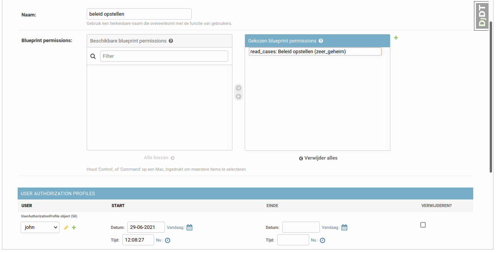

.. _authorization-profiles:

Authorization profiles
======================

Blueprint permissions can be grouped into authorization profiles. Each user can relate to one of many
authorization profiles. Therefore it is possible to create several profiles with typical
permission groups (read-only, admin, etc.) and then to relate users to them.

Like blueprint permissions authorization profiles are also managed by functional managers in the ZAC admin.

Example
^^^^^^^

In the previous subsection, we've created a blueprint permission to read ZAAKs with the ZAAKTYPE
"Beleid opstellen". Now we want to grant this permission to the user called John.

In the admin interface click on the "Toevoegen" button for "Autorisatieprofielen":

.. image:: ../_assets/authorization_authprofile_add.png
    :alt: Click on the "Toevoegen" button for "Autorisatieprofielen"

Fill in the name and select all the blueprint permissions for the authorization profile.
It's possible to search on permission type and blueprint data in the select widget.
In the "User authorization profiles" section select all the users who will have this authorization
profile and click on "opslaan" button.

The authorization profile page displays how many blueprint permissions this profile has. You can click
on the number to see all the permissions.
You can also see which users have this profile.

