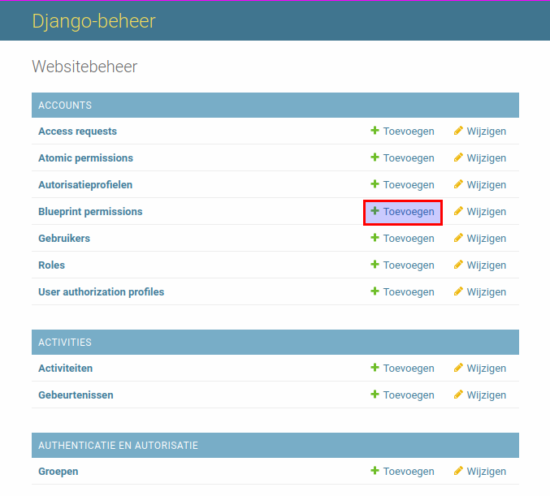

.. _authorization_blueprints:

Blueprint permissions
=====================

The permissions in the ZAC can be divided into two groups:

* blueprint permissions (based on policies)
* atomic permissions

The blueprint permission allows a user to perform a set of operations on the defined subset of the objects.
This is the main type of the permissions. Blueprint permissions are defined by functional managers
in the admin interface of the ZAC.

The user interface is only available to those with the right permissions (i.e. staff members or superusers).

The subset of the blueprint objects (or "POLICY") is defined based on object properties and unique for every object type.
For now, two blueprints POLICIES are supported:

* for zaak:
    * zaaktype (``CATALOGUS`` (write: ``URL`` or read: ``domein``) and ``omschrijving``)
    * maximum confidential level (``vertrouwelijkheidaanduiding``)

* for document:
    * informatieobjecttype (``CATALOGUS`` (write: ``URL`` or read: ``domein``) and ``omschrijving``)
    * maximum confidential level (``vertrouwelijkheidaanduiding``)

The new blueprints can be easily defined for all kinds of objects and their properties.

.. note::

   If you want to quickly create permissions for all ZAAKTYPEs you can run the following command:

   .. code:: shell

      python src/manage.py add_blueprint_permissions_for_zaaktypen

Roles (not to be confused with ROL in Open Zaak)
^^^^^^^^^^^^^^^^^^^^^^^^^^^^^^^^^^^^^^^^^^^^^^^^

Blueprint permissions link the shape of the object (blueprint) with the set of operations.
Roles represent sets of operations. It is possible to include multiple (or all) operations in one role.
Using roles simplifies re-using the same permissions for different blueprints.

Example
^^^^^^^

For example, we want to create a permission to read all ZAAKs with the ZAAKTYPEs "Beleid opstellen".

First we need to define a role.
In the admin page click on the "Toevoegen" button for "Roles":

You will see the list of all available permissions. After filling in the name of the role and
selecting the required permission click on "opslaan" button.

After the role is saved we can create a blueprint permission.
In the admin page click on the "Toevoegen" button for "Blueprint definitions":

After selecting ``object_type`` field a ``policy`` fieldset appears. It represents the blueprint and
shows which objects properties this permission applies to. Fill in all the fields and click on
"opslaan" button.

.. image:: ../_assets/authorization_blueprint_form.png
    :alt: Fill in permission data

The blueprint permission is created.