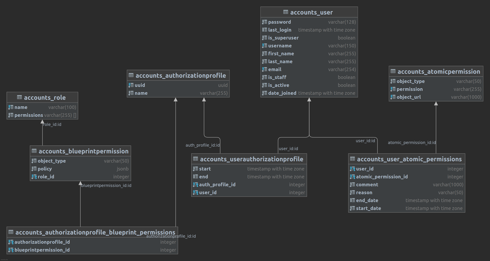

Relations between authorization objects
=======================================

For development and administration purposes here is the ER diagram for the authorization models.
It shows how users, permissions and authorization profiles related to each other.

As you can see there are many-to-many relations between models:

* ``User`` and ``AuthorizationProfile``
* ``User`` and ``AtomicPermission``
* ``AuthorizationProfile`` and ``BlueprintPermission``
* ``ApplicationToken`` and ``AuthorizationProfile``

This structure helps to create unique blueprint and atomic permissions and relate users and applications to these
objects.