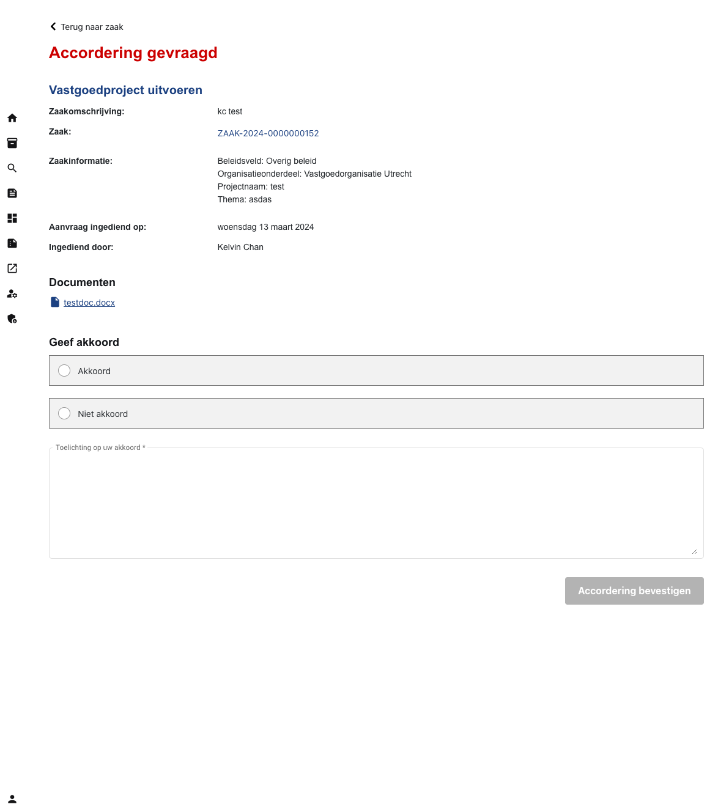

.. _akkoord:

Accordering
======================

This interface allows users to fill out a form to approve or disapprove of the matters presented. Users can also read preselected documents and provide their clarifications with text.

    Accordering interface
