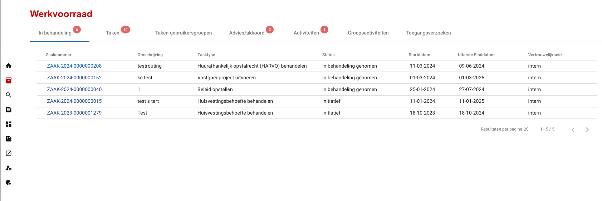

.. _werkvoorraad:

Werkvoorraad
======================

Work inventory. An overview of all the cases and tasks that the user is involved in.

    Werkvoorraad

**In behandeling**
Shows the cases in which the user is involved.

**Taken**
Shows the tasks in a case that are assigned to the user.

**Taken gebruikersgroepen**
Shows the tasks in a case that are assigned to the user group in which the user is part of.

**Advies/akkoord**
Show the active "Advies" or "Akkoord" tasks for the user.

**Activiteiten**
Deprecated

**Groepsactiviteiten**
Deprecated

**Toegangsverzoeken**
Shows the access requests for the cases in which the logged in user is the main handler.
Example: user A wants to access "Zaak 123" but does not have the rights to access the case. The case will not be visible for user A. User A can submit an access request on the case page. The main handler of the case will see the request in their list of "Toegangsverzoeken".
