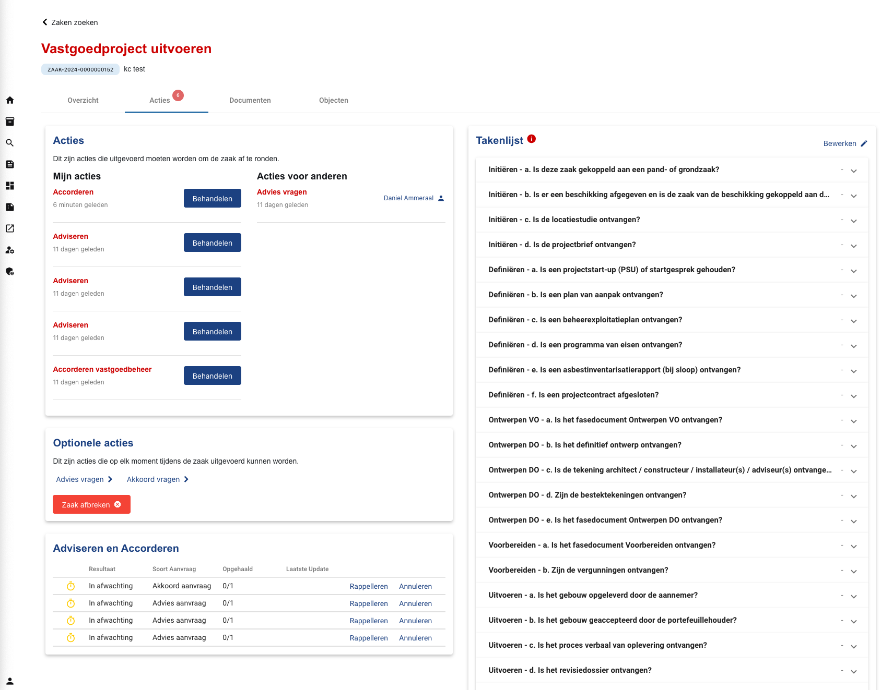
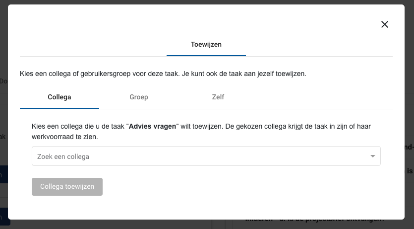
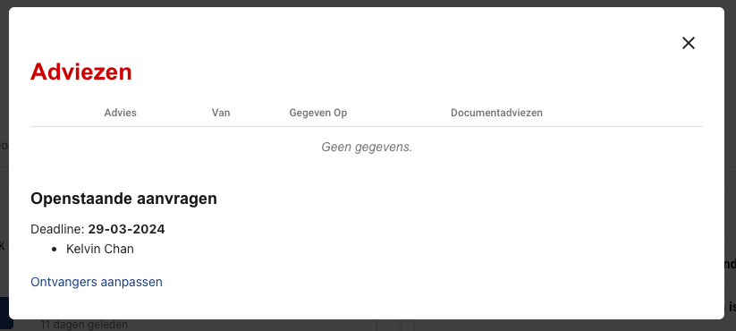
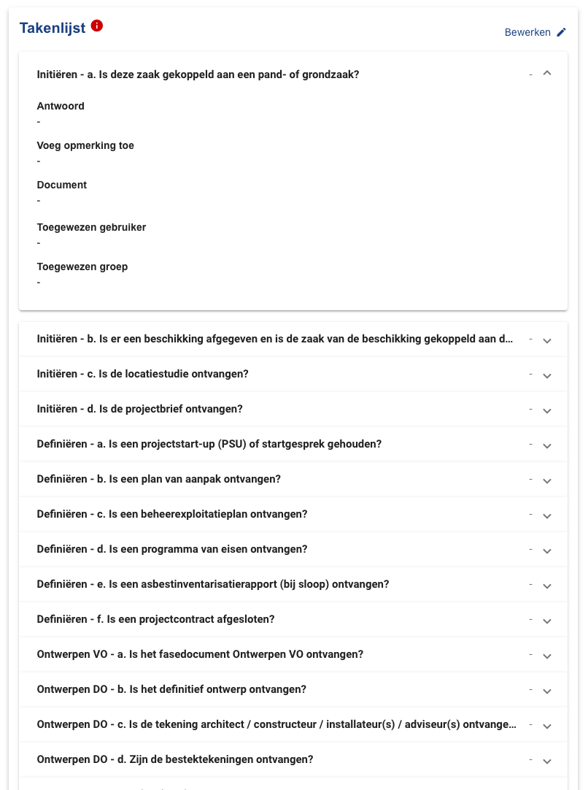
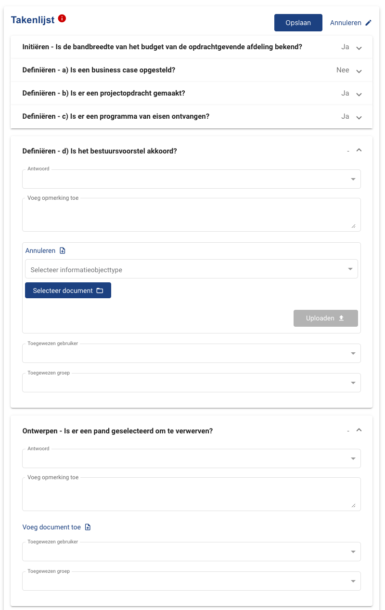

.. _acties:

Acties
======================

This is the overview of the tasks of a :class:`.Zaak`.

    Task overview interface

Acties
--------------

This part displays the current tasks of a :class:`.Zaak`. It is divided into two sections: tasks assigned to the user and tasks assigned to other colleagues.

**What are tasks?**
Each task is part of a Camunda process (for more information about Camunda please refer to the backend documentation). When opening a task, a pop-up with a form will show up. The user can fill in the form to finish the task. The layout of the form is configured in Camunda.

**Triggering tasks**
Tasks can show up in two ways:
- Trigger from "Optionele acties" in the section below.
- By finishing a previous task that progresses the camunda process. The new step in the camunda process will create a new task.

A user with the proper rights is allowed to re-assign a task to another user.
- To re-assign your own tasks to other users, click on the "Behandelen" and go to the "Toewijzen" tab.
- To re-assign others' tasks to yourself or other users, click on the currently assigned persons' username in the right section.

    Re-assign task

Optionele acties
----------------

This part allows a user to create new tasks, which can initiate or terminate a process of a :class:`.Zaak`.

Adviseren en Accorderen
-----------------------

This is a table with an overview of active or historical Kownsl requests. By clicking on a row, the user can view detailed information of a Kownsl request. A user can also remind people to answer the request ("Rappelleren") or cancel a request ("Annuleren").

    Detail view of a requests

The user is also allowed to change the recipients of a request. By clicking on "Ontvangers aanpassen" a new task in the "Acties" section above will be created.

Takenlijst
--------------

This is task list of non-process-coupled tasks. Users can give answers or assign other users to a predefined task. Assigned users will find the task on their "Werkvoorraad" page. The task list can be configured on the

    Task list

    Edit task list
