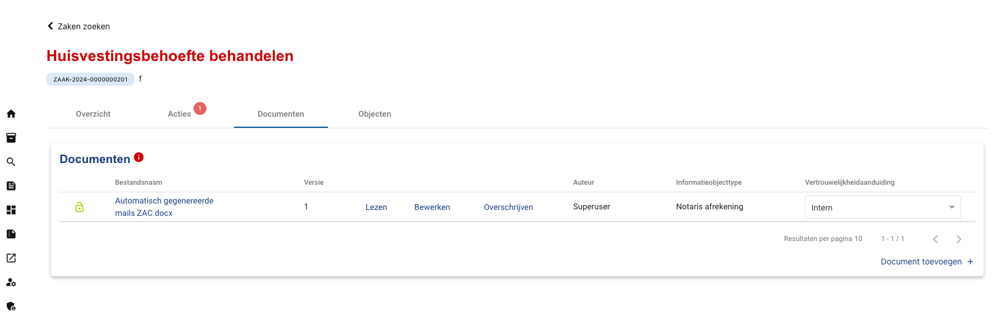
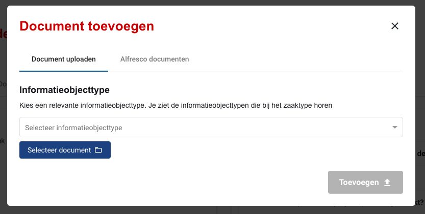
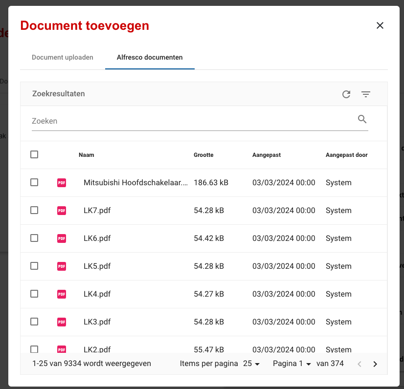

.. _documenten:

Documenten
======================

This is the overview of all the documents related to a :class:`.Zaak`.

    Document overview interface

The user can perform these actions on a document:
- View document details (click on document name)
- Read
- Edit
- Overwrite
- Change confidentiality

There are two ways to add a new document to a case:

    1. Add document from drive

    2. Add Alfresco document
