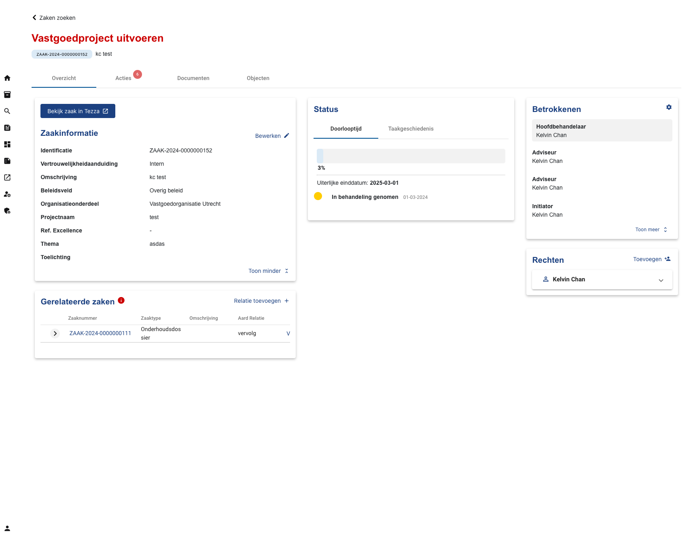
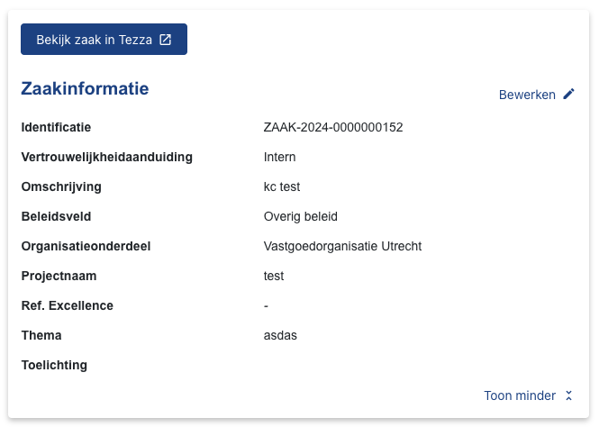
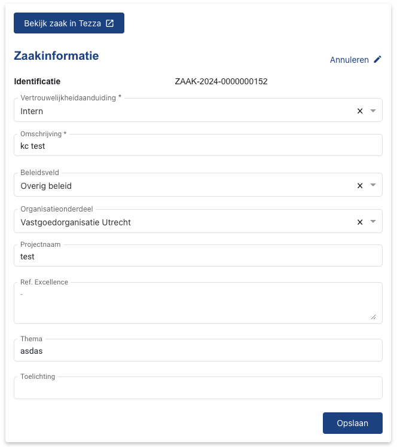
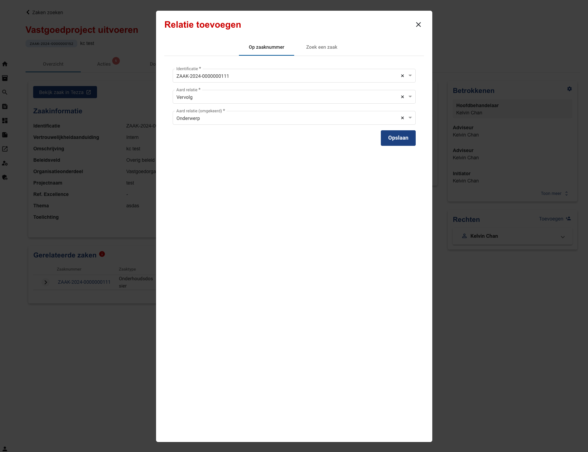
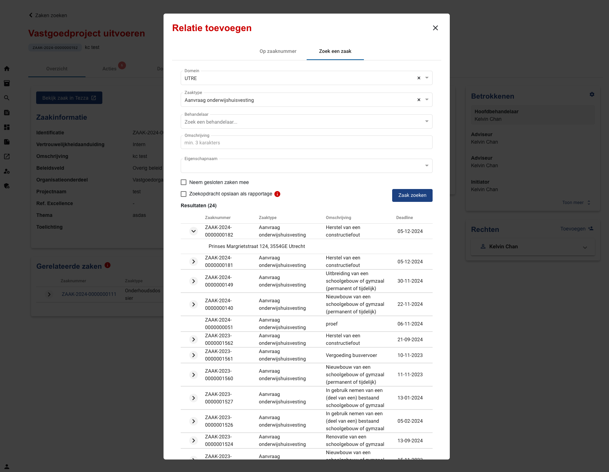
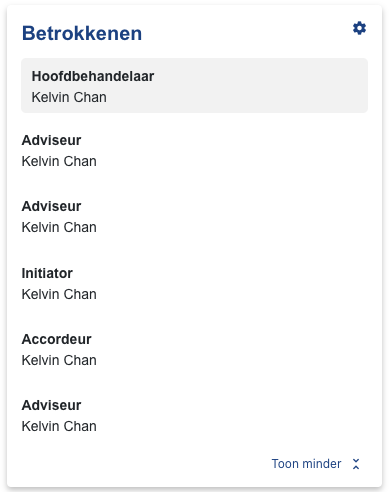
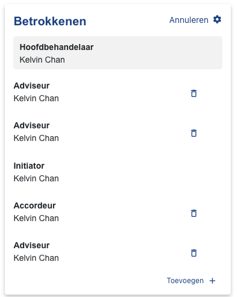
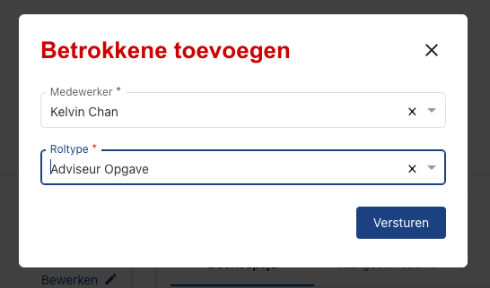
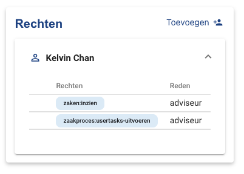
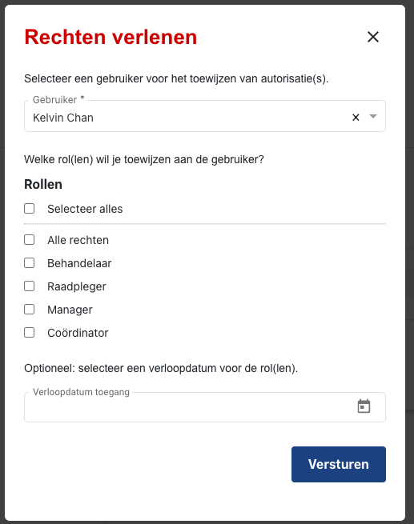

.. _overzicht:

Overzicht
======================

This is the overview of a :class:`.Zaak`.

    Case overview interface

Zaakinformatie
--------------

This section displays the properties of a :class:`.Zaak`. Some of these properties may be editable depending on business logic.

    Case properties

    Edit case properties

Gerelateerde zaken
-------------------

This section displays related cases of a :class:`.Zaak`. Relations can be added or removed.

**Add relation**

    Add case relation by identification

    Search cases to relate

Status
--------------

This section displays the status of a :class:`.Zaak` and keeps track of tasks and the deadline.

.. figure:: ../../_assets/ui/zaken/overzicht/overzicht_status-doorlooptijd.png

    Timeline status

.. figure:: ../../_assets/ui/zaken/overzicht/overzicht_status-taakgeschiedenis.png

    Tasks history

Betrokkenen
--------------

This section displays the involved persons in a :class:`.Zaak`.

    Overview of involved persons

    Edit involved persons

    Add involved persons

Rechten
--------------

This section displays the persons with authorisation rights in a :class:`.Zaak`.

    List of persons with authorisation rights

    Give a person authorisation rights
